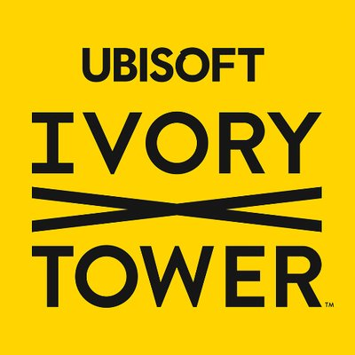
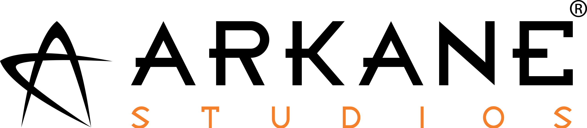
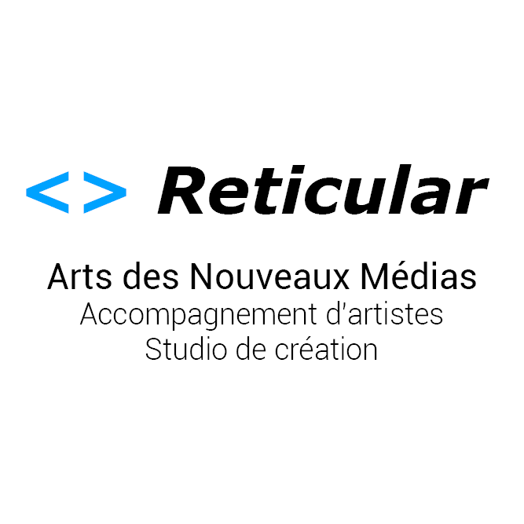
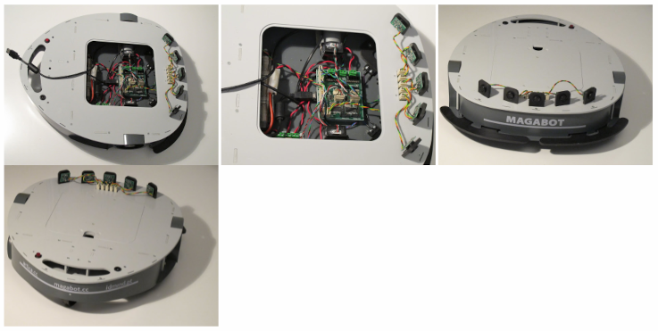
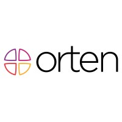
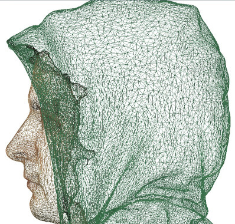

+++
draft = false
title = 'About'
+++

Hello!
My name is Alexandre Baron (he/him) and I'm the author of the blog you're reading right now.

I'm a professional video game programmer from France, currently living in Montréal, Canada, and working at Ubisoft on a title codenamed Assassin's Creed Hexe.

My range of interests is wide, and I like to think of myself as a jack of all trades that can work in many different parts of a video game production.

Video games are known to incorporate multiple, unrelated subjects together (audio, graphics, physics, AI...), and knowing a bit about how everything works is really what I strive for.

But, if I had to choose one among all those subjects, I think I would put computer graphics first, as that has been a long-time passion.

My programming language of expertise would be C++, as that's the one I'm using everyday, but I'm also used to work with Python and a bit of JavaScript.

Recently, I'm working in team lead positions that require to know less about the code, and more about how to manage and work with people who sometimes have very different backgrounds, personalities, cultures.
One of my areas of interest is how to improve workflows and figure out the best project methodology at hand.
I realized two projects are never exactly the same, so it's a constant process of adaptating our knowledge and processes to fit the problems at hand.

# Career

From newest to oldest.

## 3Cs Programming Team Lead (Jul 2024 - now)
_Ubisoft_

Leading a team of around 7 programmers in the 3Cs (Character, Controller, Camera) team on Assassin's Creed Codename Hexe.

Cannot say much about it...

## Programming Team Lead (Jan - Jul 2024)

I managed a team of 6 generalist programmers in the MOD division of Ubisoft.
MOD onboards newcomers from other industries by making them create a training video game project.
The game was showcased at the Ubisoft annual corporate party.

I was also in charge of steering the project with the design and art departments, and maintaining the build system and CI/CD pipeline of the project.

## Engine Programmer (Sep 2022 - Dec 2023)
_Ubisoft_

Worked with the Snowdrop game engine on Alterra, an Animal Crossing-inspired social simulation project (cancelled).

I worked on:
- new features and debugging in the game editor.
- making the game code deterministic using the Clang compiler.
- integrating updates to and from other versions of the engine.
- administrating a SonarQube C++ static analyzer platform for the project.
- administrating a Doxygen documentation instance to keep the project code documented.

## Game Programming Teacher (Sep 2019 - Jul 2022)
_ISART Digital Montréal_

After five years working for AAA companies, I decided to work in a school to share my knowledge with students. That is why I decided to join ISART Montréal.

I first joined the school as a teacher for the video game programming first year class, then became head of the programming department of the Montréal school starting my second year there.

My responsibilities were varied and included on-site teaching, grading, promoting the school at industry events, act as liaison with students' families, creating plannings and interviewing potential teacher candidates.

I gave lectures about multiple technical subjects at ISART, but here were the main ones:

- Basics of C and object-oriented programming with C++
- Advanced C++ (Multithreading, atomics, network sockets)
- 3D rendering, computer graphics and linear algebra (Software Rasterizer, OpenGL, GLM, Vulkan, shaders)
- Video game project generation with Modern CMake
- Using version control softwares like Git and Perforce for video games
- Test-driven development using the Catch2 testing framework
- Automatic documentation generation using Doxygen
- Project-based discovery of Unity: Animation Timeline, prefabs, physics, URP, Cinemachine...
- Project-based discovery of Unreal Engine 4: Behavior Trees, Blueprints, UE4 C++, UMG, Onlinesubsystem, Sublevels, Spline-based movement and tools.... 

The final project for the first-year class was recreating a Minecraft-like first person game, using a voxel engine using OpenGL for rendering and GLFW for windowing.

The final project for the second-year class and the curriculum was to build a C++ 3D game engine.

I gave lectures for about the following topics:

- Vulkan renderer using rendering techniques like shadow mapping, IBL, and PBR.
- Rigid-body simulation using NVidia PhysX
- Audio system using FMOD
- Skeletal Animation using hardware skinning with GLSL shaders
- Hierarchical scene description using a Scene Graph
- Multi-threaded resource manager, asynchronous game asset loading
- Entity-Component System (ECS) for data-oriented game entity management
- LUA Scripting for easy gameplay logic iteration
    ... and many more!

## Game Engine Programmer (Nov 2016 - Jul 2019)
_Ubisoft Ivory Tower (France)_

I worked on developing new engine features for the online open world racing game The Crew 2.

I made sure our systems were optimized on all target platforms of that era (PC, Xbox One, Playstation 4).

I also collaborated with game editor programmers to maintain and create new tools for artists and designers.

I also worked with the Rendering team on topics such as ocean water rendering and texture management.

My missions included, but were not limited to :

- Debugging the lock-free utilities of the asynchronous resource manager code

- Implementation of a Vehicle Locator editing system, allowing designers and artists to quickly place new assets on existing vehicles

- Various editor tools for artists and designers, curve editor and a 2D map editing tool

- Setting up an automated test bed for all available vehicles in the game, making sure they all load correctly without errors

- Implementing a time drift compensation algorithm, server and client-side

- Prototype of boids simulation for flying wildlife (birds)

- Refactoring of the whole distance-based entity spawning subsystem (mesh instancing optimization)

## Tools Programmer (Sep 2014 - Sep 2016)
_Arkane Studios (France)_

I worked for two years on Dishonored 2 until the release of the game.

My main mission was to maintain the game editor application, written in C++, and answer to every need the Art team would have to make their work easier and faster.

During this time, I had the opportunity to work with animators, 3D artists, VFX artists, and more...

Among my main missions were :

- the creation of a texel density checking tool, allowing environment artists to check the resolution of textures imported in the game engine would fit their intended use (no 4K texture for the bottom of a flower pot...)

- maintaining the existing animation keyframing tool, helping the Animation team getting their work done faster. Among other tasks, I developed a pose extractor for characters, allowing animators to quickly preview, in editor mode, the poses a given character would make in game. I also helped the development of the procedural eye movement algorithms and tools.

- the creation of an economy tracker tool, so that economic designers could easily have an overview of the amount of game money they put in a level to help them balance the game.

- the maintenance and administration of the studio's automated game performance profiling tool, Sentinel.
        This bot roamed in the game levels autonomously, taking performance profiler snapshots at key waypoints in order to identify performance pain points and help the developers pinpoint where bottlenecks came from.
        I administrated the SQL Server database, rewrote most of the SQL code base for better performance, and revamped most of the Web view of the database using the AngularJS framework to allow lead developers to better visualize the statistics gathered by Sentinel.

- the creation of a mini-database tool written in Python and SQLite in order to assess the efficiency of the game assets' packing into retail-ready data chunks format.
        The goal of this tool was to quickly generate statistics about the memory consumption of each type of asset, how to optimize their layout on disk to benefit from most recently used files, detect duplicates, etc.

## Python and Arduino Programming Intern (Apr - Jul 2013)
_MetaLab Reticular Art Center (France)_

Being a fan of stage theater, I consider myself lucky to have been able to work with MetaLab.

I helped Reticular build a project that would allow the director to remote control stage robots during a stage performance.

The end goal was to be able to program robots to carry decor elements, or to build entire choregraphies using a dedicated app on his iPad.

We started from scratch to implement this project, using a mix of Python and Arduino C++ to do it.

For the wireless network code, we used the Python Twisted event-driven framework, combined with Arduino chips plugged in to XBee shields for short-range wireless communication.

The Python application's job was to be the middleman between the iPad and the Arduino driving the wheels of the robot.

The robot model was a Magabot.

I started working on the implementation of the iPad application in Objective-C, but my contract with MetaLab ended before I could finish the project.

## C++ 3D Programmer (Feb - Apr 2013)
_Orten (France)_

An internship at Orten was my first experience in the world of real-time 3D rendering.

Orten is part of Groupe Lecante, a company specialized in building leg prosthetics and orthopedics devices in general.

Orten is the software R&D division of Lecante, working on a number of in-house developed projects that the company then sells to medical centers or for their own usage.

I worked on the flagship product of the company, OrtenShape, a CAD software used to model and correct photogrammetric body scans later used for prosthetics molding.

This software is built using C++ as programming language and Qt as a windowing interface.

My first mission was to profile the code of the application and come up with solutions to increase the performance of the most critical code paths. It got me experiencing with modern C++ multithreading, and a bit of CUDA.

Then I had to investigate a bug in VTK, the 3D visualization toolkit used by the application, to fix 3D model texturing when multiple textures are used instead of a single one.

Since it was tricky to figure out, we decided to open source on Github the source code of our solution, the vtkTexturingHelper, for other researchers to profit from it in case someone faced the same issue as us.

I wrote on my personal blog an article about this research which, according to Analytics, turned out to be a surprise hit and one of the most visited pages of the blog ever since.

